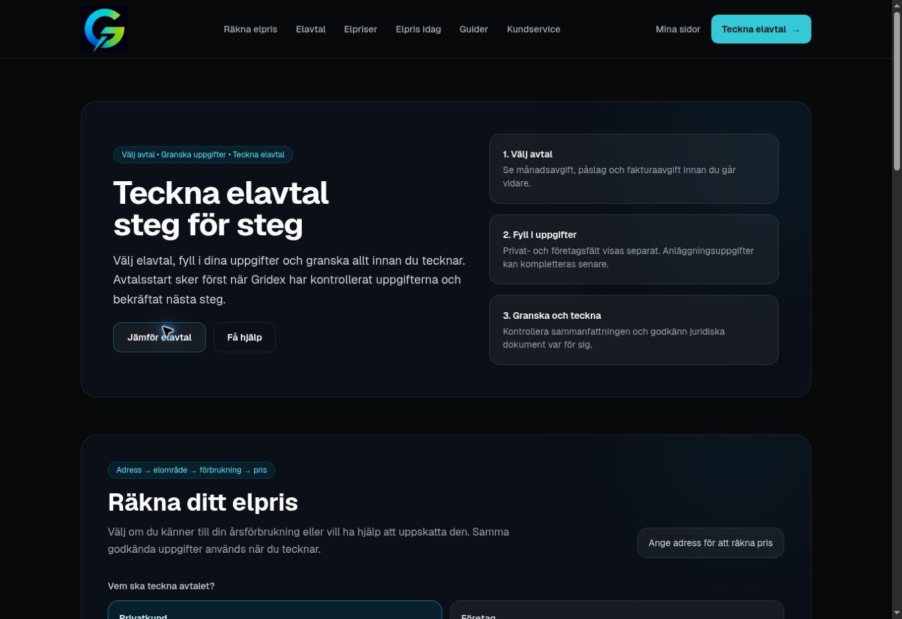

# Gridex Web production readiness — 2026-10-03

## Scope and evidence

Initial read-only Vercel and Supabase inspection and anonymous HTTP requests
were performed 2026-10-03 17:50–17:58 UTC. A subsequent production hotfix was
verified through the Vercel connector at 18:18 UTC. This audit retains the
earlier observations with their actual timing and records the latest result
separately. The audit author changed no production settings, domains, database
rows or secrets and used no customer session. This audit does not verify
authenticated support, staff RBAC, signed customer assertions or cross-tenant
flows.

Vercel team: `team_e3htkJPyBNSw3Ix1KQLlf180`.
Web project: `prj_M9CISqPbBmmX7L83lvqiAJDJfhGS` (`gridex-web`).
Supabase Web project: `ayiuxjlfazkjmmtlvhsl` (`gridex-prod`),
`ACTIVE_HEALTHY`, PostgreSQL `17.6.1.063`.

## Inspected deployments and latest production state

| Environment | Commit | Deployment | State |
| --- | --- | --- | --- |
| Preview inspected at 17:50–17:58 UTC | `be6e645481c33888bff97af509548af28d69008c` | `dpl_DiWnEvU4Rt2VNj2UPtmn5AZ9gCDT` | READY |
| Previous production inspected at 17:50–17:58 UTC | `9ae37362d05e4338701f1571df3b7b5f3762329a` | `dpl_EjJvNUbBp1ixZ1DD4bR8u1EXxHHZ` | READY, older code |
| Current production, confirmed at 18:18 UTC | `ff950425b6922df88817f840dc5a395cbceab8eb` | `dpl_AzzAxuYSZpjRdbNWbC5w7KLyQCfb` | READY; public-contract compatibility hotfix |

Preview base: `https://gridex-1i7ha688l-div3rsa.vercel.app`.
Production base: `https://gridex.se`.

The current production hotfix is PR #44, merged to `main` as
`ff950425b6922df88817f840dc5a395cbceab8eb`. Vercel confirms `target: production`,
`readyState: READY`, `aliasError: null`, with both `gridex.se` and
`www.gridex.se` assigned to deployment `dpl_AzzAxuYSZpjRdbNWbC5w7KLyQCfb`.
This hotfix restores public feed compatibility; it is not the independent
tenant/support/RBAC package rollout.

## Live HTTP observations

Protected-preview access used the connected Vercel fetch capability. Temporary
share credentials are deliberately omitted.

| Target | Observed response | Interpretation |
| --- | --- | --- |
| Preview `/login` | 200 HTML; deployment ID matches latest preview; private/no-store | Login page renders on the current deployment. |
| Preview `/support-center` | Fetch followed the anonymous navigation to HTML with `x-matched-path: /login` | Anonymous support page access leads to login; an authenticated support screen was not tested. |
| Preview `/api/auth/public-session` | 200, `{"authenticatedEmail":null}`; `Cache-Control: private, no-store, max-age=0`; `Vary: Cookie` | Anonymous session bootstrap works and uses private cache headers. This endpoint also returns null when Supabase public configuration is absent, so it alone does not establish configuration readiness. |
| Preview `/api/web/contracts` | 200, live source, upstream 200, two visible offers, zero blocked offers/warnings/compatibility issues | The preview has a usable OPS API key/base and successfully obtains and parses the current public contract feed. |
| Preview `/api/me/permissions` | 200, `{"permissions":[]}`; `Cache-Control: public, max-age=0, must-revalidate`; no `Vary: Cookie` | Anonymous permissions are empty. The deployed permission response lacks explicit private/no-store cache headers; source inspection confirms the route does not set them. Authenticated behavior was not tested. |
| Preview `/api/web/customer/support/cases` | Connector reports 401 `deployment_authentication_required`, with no application response body | The connector could not fetch the response, including an explicit share-parameter retry. This does not distinguish Vercel protection from an application 401 and provides no support-scope evidence. |
| Preview `/api/internal/integrations/gridex/health` | Same connector 401 as above | Admin-only configuration/scopes could not be read anonymously. |
| Previous production `/api/web/contracts`, 17:57:58 UTC | Actual HTTP 502 with `canonical_response_schema_invalid`, `state: feed_failed` | The older production code then serving the domain failed to parse the live canonical feed. Request reference: `cfdfdac0-6167-413c-8a86-23dd73e8a201`. The subsequent hotfix result below supersedes this as the current state. |
| Current production `/api/web/contracts`, 18:18:20 UTC | Actual HTTP 200; two visible offers; zero blocked offers/warnings/compatibility issues; no-store | The public-contract API is restored on the production hotfix. Version `.4`, publication revision `78`, and a non-stale snapshot revalidated by upstream HTTP 304. |

Latest production proof:

- Request/correlation ID: `913a1f86-fcef-4396-9c39-45b137c461fd`.
- HTTP response time: `2026-10-03T18:18:20Z`.
- `Cache-Control: no-store, max-age=0`; `Vary: Accept-Encoding`.
- `X-Gridex-Contract-Version: 2026-10-02.4`.
- `X-Gridex-Publication-Revision: 78`; `X-Gridex-Data-Stale: 0`.
- Schema SHA-256:
  `10fb2f3051f112990fe4ef63ffa18b24ee5d9b5203b1f4429a2a3d88675c43be`.
- Payload state: `feed_loaded_with_contracts`; source: `cache`; stale: `false`;
  upstream status: `304`; snapshot fetched at `2026-10-03T18:12:14.693Z`.
- Upstream/visible counts: `2`/`2`; blocked/warning/compatibility counts: `0`.

The latest response demonstrates successful compatibility and conditional
revalidation of the current public feed; it does not demonstrate a new upstream
200 fetch, authenticated customer flows, support scopes, or RBAC activation.

Preview feed metadata observed at `2026-10-03T17:55:20.364Z`:

- Contract version: `2026-10-02.4`.
- Publication revision: `78`.
- Schema SHA-256: `10fb2f3051f112990fe4ef63ffa18b24ee5d9b5203b1f4429a2a3d88675c43be`.
- Source: `live`; stale: `false`; upstream status: `200`.
- Upstream/visible counts: `2`/`2`; blocked/warning/compatibility counts: `0`.
- Request/correlation ID: `083053c4-7050-4c60-9164-d35d97f10a21`.

Successful public-contract reads do not establish the website state-signing
secret, customer assertion, customer support scopes, staff roles, or a real
customer identity binding. `getOpsTransportStatus()` checks the API key and
base URL; these additional requirements need authenticated inspection and
real flow verification.

## Support domain and DNS

The Vercel project currently lists `gridex.se`, `www.gridex.se` and three
project-generated Vercel aliases. It does not list `support123.gridex.se`.
Fetching `https://support123.gridex.se/` through the connector fails at
`lookup_deployment` with 404. This is consistent with the missing project
domain but does not establish public DNS status.

Local DNS resolution for `support123.gridex.se`, `gridex.se` and
`www.gridex.se` all failed with the same temporary resolver error. The known
working apex failing too means this observation is not evidence of NXDOMAIN.
The external DNS metadata endpoint was unavailable to the retrieval tool.
Public DNS and TLS therefore remain unverified.

## Source-required environment and authentication configuration

Values were not retrieved. The following names and requirements come from the
current repository source and deployment guide.

| Name | Requirement / current evidence |
| --- | --- |
| `GRIDEX_API_KEY` | Server-only, full OPS tenant API key. Public feed success proves a usable key for public contracts on preview. Support additionally requires `customer_support.read` and `customer_support.write`; those scopes were not verified. |
| `GRIDEX_OPS_API_URL` | Canonical production value `https://app.gridex.se/api/v1`; this is also the source default. Production rejects other origins. |
| `GRIDEX_WEBSITE_STATE_SIGNING_SECRET` | Server-only, at least 32 UTF-8 bytes. Preview/production presence and validity were not verified. |
| `GRIDEX_WEBSITE_STATE_SIGNING_KID` | Optional rotation identifier; source default `current`. |
| `GRIDEX_WEBSITE_STATE_SIGNING_PREVIOUS_SECRET`, `GRIDEX_WEBSITE_STATE_SIGNING_PREVIOUS_KID` | Optional previous-key rotation configuration. |
| `NEXT_PUBLIC_SUPABASE_URL`, `NEXT_PUBLIC_SUPABASE_ANON_KEY` | Web's own Supabase URL and public key. Required by browser/server session clients. Actual values were not retrieved. |
| `SUPABASE_SERVICE_ROLE_KEY` | Server-only Web Supabase service credential, required for server-owned operations. Actual value was not retrieved. |
| `NEXT_PUBLIC_SITE_URL` | Main Web origin used for server-issued onboarding/recovery links; source fallback `https://gridex.se`. |
| `GRIDEX_WEB_COMPANY_ID` | Optional local authentication company UUID, never the OPS internal company ID or opaque organization reference. Absence means global permissions only. |
| `GRIDEX_CUSTOMER_ASSERTION_REQUIRED` | Set to `true` when the OPS tenant requires signed identity assertions. Actual tenant policy and deployed setting were not verified. |
| `GRIDEX_CUSTOMER_ASSERTION_PRIVATE_KEY`, `GRIDEX_CUSTOMER_ASSERTION_ISSUER`, `GRIDEX_CUSTOMER_ASSERTION_AUDIENCE`, `GRIDEX_CUSTOMER_ASSERTION_KID` | All four server-only settings are required when assertion signing is enabled or required. Public key must be registered in OPS. Never use `NEXT_PUBLIC_` names for the private key. |
| `GRIDEX_CUSTOMER_ASSERTION_ALGORITHM` | Optional `RS256`, `PS256` or `ES256`; source validates RSA >=2048-bit or P-256 EC keys. Enabling only this setting still requires the four assertion settings. |
| `GRIDEX_WEBHOOK_SIGNING_SECRET` | Server-only canonical webhook verifier secret, at least 32 bytes for readiness. |
| `CRON_SECRET` | Shared fallback for scheduled portal, onboarding, notifications and webhook retry workers. |
| `CUSTOMER_PORTAL_OUTBOX_CRON_SECRET`, `CUSTOMER_PORTAL_ONBOARDING_CRON_SECRET`, `WEBHOOK_RETRY_CRON_SECRET` | Optional worker-specific alternatives to `CRON_SECRET`. |
| `GRIDEX_DATABASE_MIGRATIONS_READY`, `GRIDEX_WEBHOOK_PROJECTIONS_READY`, `GRIDEX_STAGING_FLOW_VERIFIED` | Evidence flags checked by readiness; mark true only after their actual migration, projection and real-flow verification requirements pass. |

Registration and user-initiated password recovery construct the callback from
`window.location.origin`, using `/auth/confirm`. Password recovery adds
`next=%2Flogin%2Freset-password`. The confirm route uses the callback origin
for its subsequent same-origin redirect. Server onboarding instead derives
the callback from `NEXT_PUBLIC_SITE_URL` or its main-origin fallback.

Supabase Auth must preserve all existing redirect entries and allow
`https://support123.gridex.se/auth/confirm` for support-origin confirmation and
recovery. Sessions remain host-bound. These Auth settings were not inspected.

## Exact access blocker and next actions

The connected Vercel registry exposes read-only project/deployment tools and
protected URL fetching, but no environment-variable listing or write tool,
project-settings write tool, or domain-add tool. The Supabase registry exposes
database/migration tools but no Auth config read/update tool. Neither Vercel
nor Supabase CLI is installed and no corresponding credential environment
variables are available. Connected OAuth credentials were not extracted.

Supported authenticated alternatives, verified against official docs:

- Vercel environment listing: `GET /v9/projects/{projectId}/env`.
- Vercel environment upsert: `POST /v10/projects/{projectId}/env` with
  `teamId` and `upsert=true`; preserve unrelated keys and configure the intended
  production/preview targets.
- Support domain assignment: `POST /v10/projects/{projectId}/domains` with
  `teamId` and `{"name":"support123.gridex.se"}`. Follow the returned
  verification/DNS instructions; do not guess a CNAME.
- Supabase Auth inspection/update:
  `GET` / `PATCH /v1/projects/ayiuxjlfazkjmmtlvhsl/config/auth`, preserving
  existing `uri_allow_list` entries.

These routes require appropriate authenticated CLI or management API access.
Dashboard fallback was not initialized; the browser tool's instructions
require user approval when sufficient plugin capabilities are unavailable.

## Direct public website UI observation

Read-only cloud-browser inspection at 2026-10-03 18:04–18:06 UTC inspected
the public Gridex website itself. This did not open or operate the Vercel
dashboard or attempt account sign-in.

- `https://gridex.se/` rendered the public homepage and calculator, with
  `Gridex Fast pris` and `Gridex Månad` as available contract options.
- Following the visible `Elavtal` link to `https://gridex.se/elavtal` rendered
  both public offer cards and their terms, without a visible loading error.
- Following the visible `Teckna elavtal` link to
  `https://gridex.se/teckna-avtal` rendered the initial calculator and stated
  that customer details open only after the price is verified. No customer
  details were entered, quote requested, application created, legal terms
  accepted or contract signed.
- Captured browser console errors on those pages originated from the browser
  extension's metadata messaging (`chrome-extension://…/content-script.bundle.js`).
  No Gridex-origin application console error was captured during this initial
  navigation. This does not establish that deeper flows have no errors.
- The initial rendered offer/calculator views did not visibly exhibit the
  `/api/web/contracts` error observed by the connector earlier at 17:57:58 UTC.
  That API 502 was established for the previous production revision, without
  implying that all public pages or the complete signup flow failed. The
  current production API returns 200 after the hotfix at 18:18 UTC.
- Direct browser navigation to `/api/web/contracts` was blocked by the browser
  client/URL policy. That browser route was stopped; it is not evidence of
  site bot detection or a site HTTP status. The actual endpoint result above
  comes from the connected Vercel fetch capability.
- Direct navigation to the current preview's `/login` reached the Vercel
  protection sign-in wall. No account interaction was attempted. Rendered
  preview app UI was therefore not verified with this browser; the earlier
  connector HTML and header observations remain the preview evidence.

Screenshot of the verified public signup initial view:

The independent-tenant candidate now contains ten forward migrations: one
RBAC ACL migration already applied and nine remaining migrations. The manifest
contains 48 migration files. This is the candidate package state, not evidence
that the remaining nine migrations have been applied in production.

The deployment guide requires a coordinated code/configuration/domain cutover
before the remaining Web migrations. The public-feed-only hotfix preserves the
existing production administrative architecture, whose postal/agreement
operations use session clients. The already-applied RBAC ACL migration must
not be reapplied. Real authenticated customer/support and separate-tenant tests
remain required after configuration and deployment.

References:

- `docs/independent-tenant-support.md`
- `lib/ops/config.ts`, `lib/ops/customerAssertion.ts`, `lib/ops/transport.ts`
- `lib/supabase/client.ts`, `lib/supabase/server.ts`, `lib/supabase/service.ts`
- `lib/customerPortal/onboarding.ts`
- `app/register/page.tsx`, `app/login/forgot-password/page.tsx`,
  `app/auth/confirm/route.ts`
- https://vercel.com/docs/rest-api/sdk/projects/create-one-or-more-environment-variables
- https://vercel.com/docs/rest-api/reference/endpoints/projects/add-a-domain-to-a-project
- https://supabase.com/docs/reference/api/v1-get-auth-service-config
- https://supabase.com/docs/reference/api/v1-update-auth-service-config
